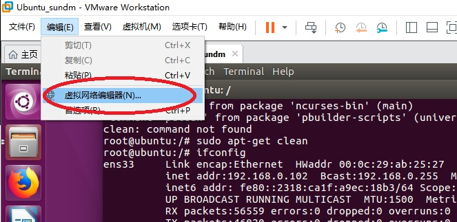
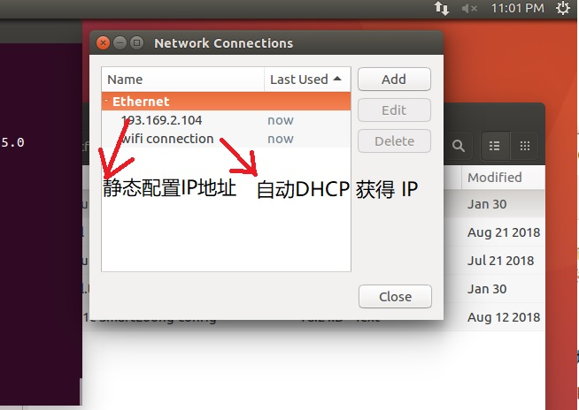

# 1. 虚拟机的网络配置模式
使用 VMware Workstation 进行虚拟机的网络配置。

- 桥接模式

虚拟机中的虚拟网络适配器可通过主机中的物理网络适配器直接访问到外部网
相当于在局域网中添加了一台新的、独立的计算机一样

- NAT模式

相当于虚拟系统把物理主机作为路由器访问互联网，虚拟机和主机在共享一个IP地址

- 仅主机模式

虚拟系统和真实的网络是被隔离开的，相当于两台机器通过双绞线（网线）互连。

# 2.   VMware虚拟设备

1.  三种虚拟交换机（对应三种网络模式）

VMnet0 虚拟交换机 ：Bridged桥接模式

VMnet1 虚拟交换机 ：Host-Only仅主机模式

VMnet8 虚拟交换机 ：NAT模式

如图1所示，先恢复初始默认配置。

# 3. 具体配置

笔记本电脑使用无线上网，连接到自家路由器的，因此将开发板使用网线连接到笔记本电脑上。

我电脑的网卡非常之多：

1、虚拟机的网卡，非常明显，WMware Network Adapter ...

2、无线网卡，比较明显，Realtek 8821CE Wireless...

3、热点虚拟网卡，这个你在使用360wifi的时候就有会，很容易分辨，Microsoft Wi-Fi...

4、笔记本无线有线网卡 Realtek PCIe GbE...

5、最后一个是用于 RealEvo-Simulator 虚拟机网卡。

如图2所示。

涉及实验的只有电脑的无线网卡或者电脑的有线网卡，在特殊一点使用USB无线网卡，其它的大家忽略。

对于每个网卡的IP地址，可用查看详细资料和属性来查看和配置网络地址。 

如图3 图4所示。

下面，网络IP都可以确定了：

- 193.169.2.215 为笔记本电脑Windows的IP，为静态IP, 手动分配，与开发板连接。

- 192.168.0.106 为主机的无线网络IP，与外网连接，这里连接到家庭的无线路由上，由路由器自动分配。

- 193.169.2.230 为开发板的IP，与开发板连接。
  
- 193.169.2.200 为笔记本电脑的VMnet8 的静态IP地址，起桥接作用。

- 虚拟机：待配置。

# 4. 配置虚拟机连接到外网

如图5所示在VMware Workstation的虚拟网络编辑器中配置。
如图6所示

如图7示，在虚拟机中配置2个虚拟机的网络。
其中，wifi connection为自动获取IP地址； 193.169.2.217 为静态配置的IP地址。
配置虚拟机中连接 wifi connection。
打开虚拟机，则自动连接到外网，使用命令 "ifconfig" 查看网络，并可 ping 通百度。如图8所示。

# 5. 配置虚拟机连接到开发板和主机

配置主机笔记本电脑的VMnet8 的静态IP地址为193.169.2.200，起桥接作用。如图9所示。

配置虚拟机桥接到有线网卡。如图10所示。

打开虚拟机，配置 ens33 网络
方法一：使用命令 "ifconfig" 查看网络，并可 ping 通开发板和主机。
如图11所示。

方法二：在虚拟机中使用图7中的193.169.2.217 静态配置的IP地址。