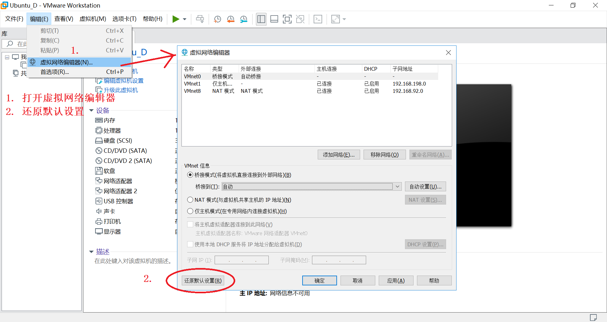
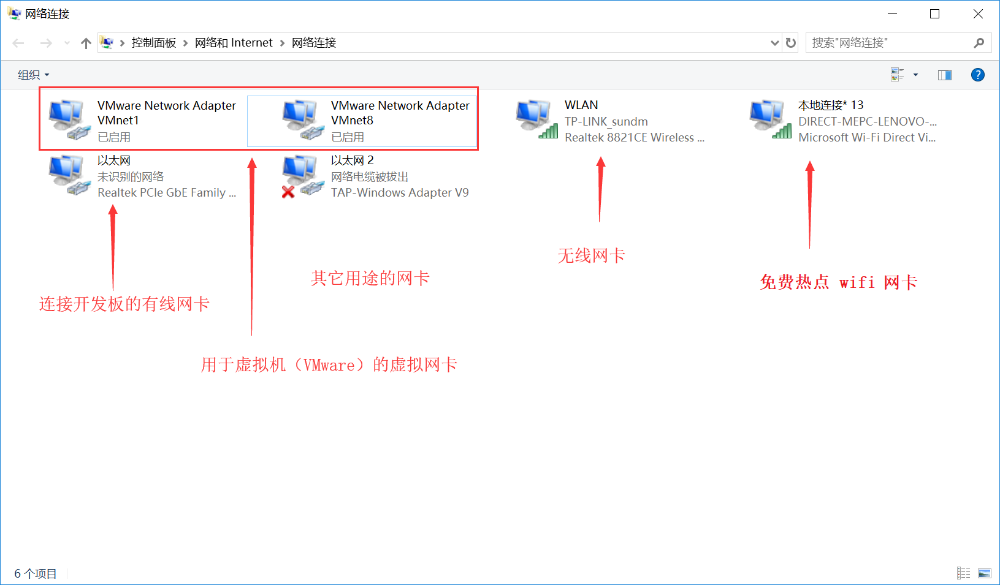
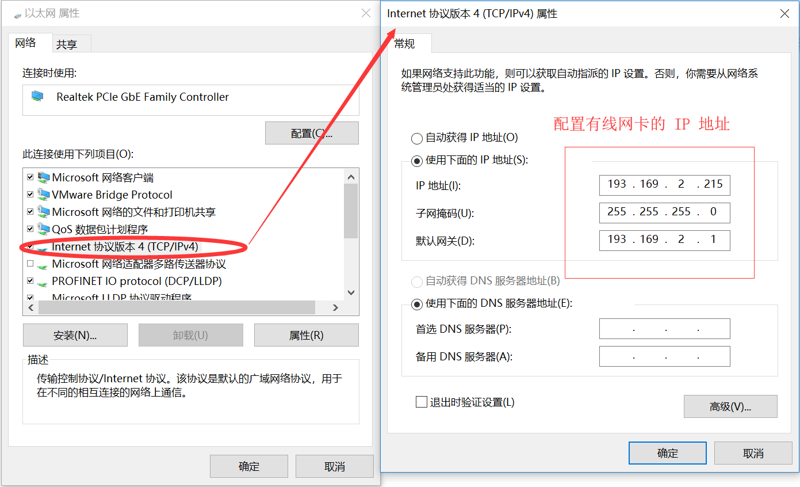
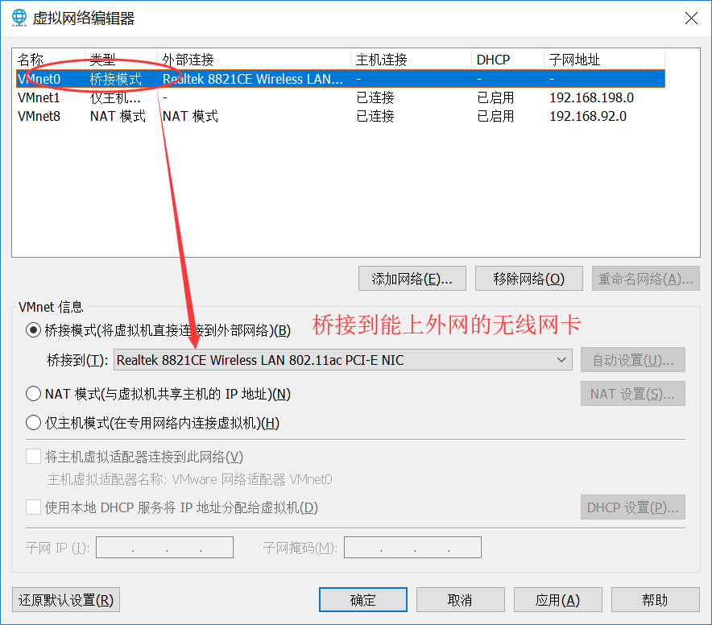
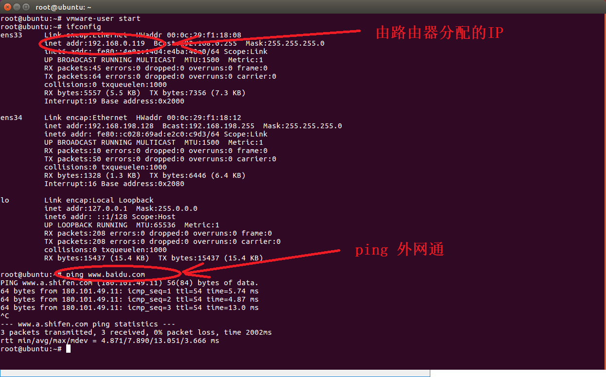
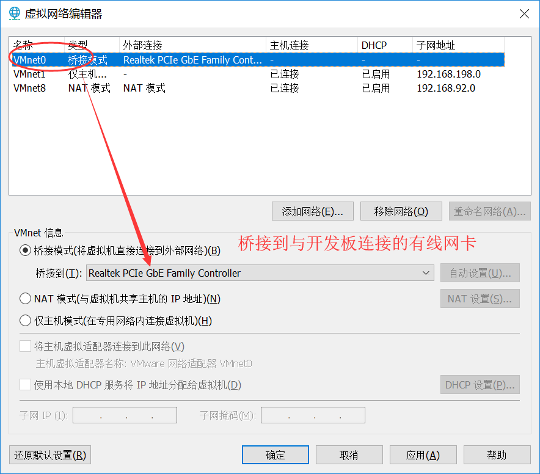
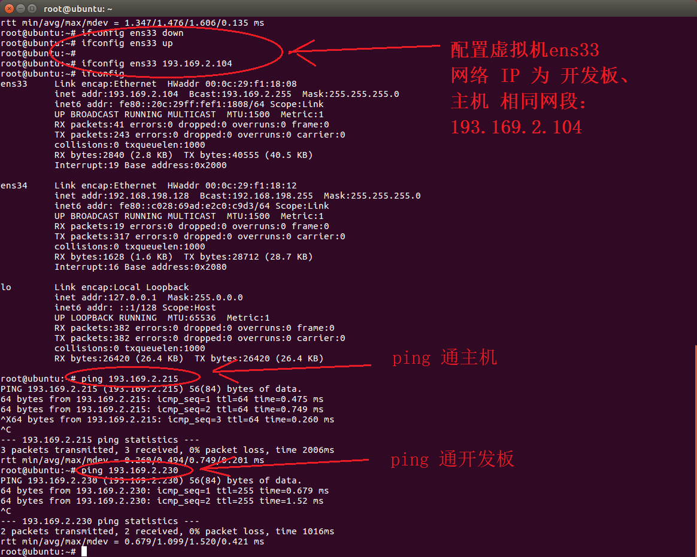

# 1. 虚拟机的网络配置模式
使用 VMware Workstation 进行虚拟机的网络配置。

- 桥接模式

虚拟机中的虚拟网络适配器可通过主机中的物理网络适配器直接访问到外部网
相当于在局域网中添加了一台新的、独立的计算机一样

- NAT模式

相当于虚拟系统把物理主机作为路由器访问互联网，虚拟机和主机在共享一个IP地址

- 仅主机模式

虚拟系统和真实的网络是被隔离开的，相当于两台机器通过双绞线（网线）互连。

# 2.   VMware虚拟设备
1.  三种虚拟交换机（对应三种网络模式）

VMnet0 虚拟交换机 ：Bridged桥接模式

VMnet1 虚拟交换机 ：Host-Only仅主机模式

VMnet8 虚拟交换机 ：NAT模式

Use bridged networking（使用桥接网络）
说明：使用VMnet0虚拟交换机，此时虚拟机相当与网络上的一台独立计算机与主机一样，拥有一个独立的IP地址。

使用桥接方式，A，A1，A2，B可互访。

Use network address translation（NAT）

说明：使用Vmnet8虚拟交换机，此时虚拟机可以通过主机单向网络上的其他工作站，其他工作站不能访问虚拟机。

使用NAT方式，A1，A2可以访问B，但B不可以访问A1，A2。但A，A1，A2可以互访。
Use Host-Only networking（使用主机网络）
说明：使用Vmnet1虚拟交换机，此时虚拟机只能与虚拟机、主机互访。也就是不能上Internet 

如图所示。

# 3. 具体配置
转载自：https://blog.csdn.net/czg13548930186/article/details/76771899
1、电脑使用无线上网，但是无法将开发板链接到电脑所连接的AP，比如校园 wifi、公司wifi。

2、电脑使用无线上网，无线是自己的路由器发射的(我认为这也需要用网线与路由器相连)，因此可以将开发板使用网线连接到路由器上。

3、电脑使用有线上网，网线是连接到自家路由器的，因此可以将开发板使用网线连接到路由器上。

对于情况1，建议购买路由器或者交换机，使用PC的有线网卡，建立3者之间的互联互通，购买路由器之后，将电脑和开发板都使用网线接入路由器的LAN口，路由器无需多余设置，电脑参数与情况3相同，但是正常情况下虚拟机无法上网，想要虚拟机上网需要更改设置（更改之后无法Ping通）。

对于情况2，使用PC的无线网卡,建立3者之间的互联互通，虚拟机通过主机可以上网。

对于情况3，使用PC的有线网卡，建立3者之间的互联互通，虚拟机通过主机可以上网。

这里重点讨论情况2、3。

我电脑的网卡非常之多：

1、虚拟机的网卡，非常明显，WMware Network Adapter ...

2、无线网卡，比较明显，Realtek 8821CE Wireless...

3、热点虚拟网卡，这个你在使用360wifi的时候就有会，很容易分辨，Microsoft Wi-Fi...

4、笔记本无线有线网卡 Realtek PCIe GbE...

5、最后一个是用于 RealEvo-Simulator 虚拟机网卡。

如图所示。

涉及实验的只有电脑的无线网卡或者电脑的有线网卡，在特殊一点使用USB无线网卡，其它的大家忽略。

对于每个网卡的IP地址，可用查看详细资料和属性来查看和配置网络地址。 

如图所示。

下面，网络IP都可以确定了：

- 193.169.2.215 为主机的IP，为静态IP, 手动分配，与开发板连接。

- 192.168.0.106 为主机的无线网络IP，与外网连接，这里连接到家庭的无线路由上，由路由器自动分配。

- 193.169.2.230 为开发板的IP，与开发板连接。

- 虚拟机：待配置

# 4. 配置虚拟机连接到外网

如图所示。

打开虚拟机，则自动连接到外网，使用命令 "ifconfig" 查看网络，并可 ping 通百度。

如图所示。

# 5. 配置虚拟机连接到开发板和主机

如图所示。

打开虚拟机，先配置 ens33 网络，使用命令 "ifconfig" 查看网络，并可 ping 通开发板和主机。

如图所示。

